# Game Design Document (GDD) (Lights Out)

### Table of contents

- [Game Design Document (GDD) (Lights Out)](#game-design-document-gdd-lights-out)
    - [Table of contents](#table-of-contents)
  - [Game Overview 💡](#game-overview-)
    - [Core Concept](#core-concept)
    - [Related Genre](#related-genre)
    - [Target Audience](#target-audience)
    - [Unique Selling Points (USPs)](#unique-selling-points-usps)
  - [Story and Narrative 🌃](#story-and-narrative-)
    - [Backstory](#backstory)
    - [Characters](#characters)
  - [Gameplay Mechanics 🎮](#gameplay-mechanics-)
    - [Player Perspective](#player-perspective)
    - [Controls](#controls)
    - [Crafting \& Placing Items](#crafting--placing-items)
    - [Progression](#progression)
  - [User Interface (UI) 🛑](#user-interface-ui-)
    - [Main Menu](#main-menu)
    - [Game's main UI](#games-main-ui)
    - [Crafting UI](#crafting-ui)
  - [Levels and World Design 🌏](#levels-and-world-design-)
    - [Game World](#game-world)
    - [Objects](#objects)
    - [Craftables and Interactables](#craftables-and-interactables)
  - [Art and Audio 🎨 🔊](#art-and-audio--)
    - [Art Style](#art-style)
    - [Sound and Music](#sound-and-music)
    - [Assets](#assets)
  - [Team Communication, Timeline and Task Assignment 🤝](#team-communication-timeline-and-task-assignment-)
    - [Tools 🔧](#tools-)
    - [Timeline \& Task Assignment 📆](#timeline--task-assignment-)
  - [Possible Challenges ⚠️](#possible-challenges-️)

## Game Overview 💡

  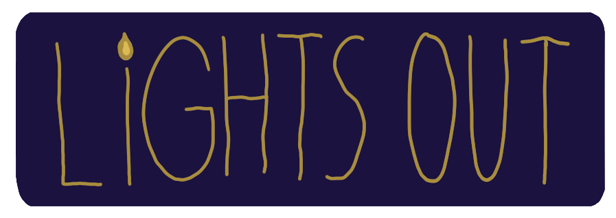

### Core Concept

The game's core concept centres on the player surviving in the darkness by keeping their only starter light source illuminated through refueling. Without light, the player's sanity will be constantly drained. To avoid **Lights Out**, the player must navigate their way through the hostile unknown to gather materials for refueling their light source(s). They may also light up the map to broaden their safe zone by crafting new light sources with any excess materials they have. In an environment with imperceptible dangers, the player must venture out to the darkness to collect essential resources and construct and expand their base while evading environmental threats. The game ends when the player has successfully lit up all of the map.

### Related Genre

This is a survival-crafting game with an eerie atmosphere, inspired by the game "Don't Starve". We've incorporated similar sanity and crafting mechanics while introducing our own unique twist. Unlike other games of the same genre, which often use physical enemies, we've opted to use darkness and uninteractable enemies as the primary threats. This choice is to further enhance the eerie, dark aesthetic, creating a more immersive and unsettling gameplay experience.

  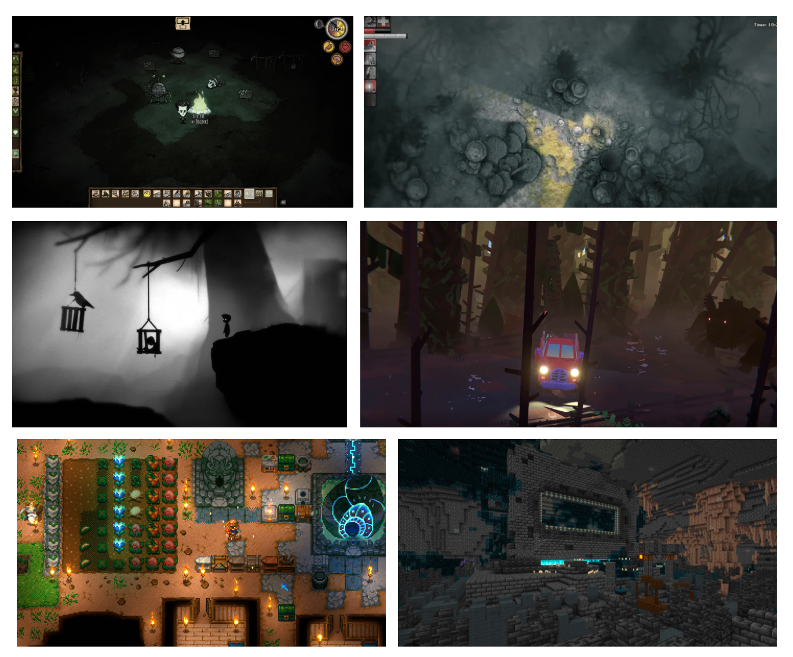

(From Top Left to Bottom Right)
_Don't Starve_ [Video game]. (2013). Klei Entertainment.
_Darkwood_ [Video game]. (2017). Crunchy Koalas.
_Limbo_ [Video game]. (2010). Playdead; Double Eleven.
_Truckful_ [Video game]. (2024). Mythic Owl.
_Core Keeper_ [Video game]. (2022). Fireshine Games.
_Minecraft_ [Video game]. (2011). Mojang.

### Target Audience

This game's target audience is young adults and adults aged 15 - 30. This game will offer an engaging gameplay experience for players who enjoy survival-crafting games with a touch of creepy, eerie aesthetic.

### Unique Selling Points (USPs)

- **Perpetual Nighttime Setting**
  The game world is forever stuck in nighttime, leaving the player constantly surrounded by darkness. This design choice not only creates a deeply eerie atmosphere but also evokes a haunting sense of isolation, enhancing the overall game experience.
- **Darkness & Intangible Threats**
  In our game, danger doesn't come from physical enemies. Instead, Darkness and Enemies that the player cannot interact with serve as the primary source of threats. With their beacon of safety - the light source, at risk of running out of fuel, the player is forced to venture into the darkness in search of materials. The tension of being in unknown danger throughout the game encourages players to continuously learn and adapt. Rather than offering a combat-focused experience, this game rewards those who are smart and brave enough to safely navigate the unknown, gather resources, and expand their base.
- **Survive by Lighting up the Darkness, then Get Creative!**
  Light sources are not the only craftables in this game. As the player becomes more efficient at gathering resources and maintaining their light sources, they can turn excess materials into decorative items. This adds a layer of depth to the gameplay, allowing players to express their creativity and transform the game environment.

## Story and Narrative 🌃

### Backstory

The story is set in a forest during the summer, where the main character, Adam, decides to go camping to escape the stress of his current life crisis. After what seemed like a typical night of camping, he goes to sleep in his tent as usual. However, when he wakes up the next morning, he is still surrounded by darkness, even though it’s 6 AM. Strangely, Adam notices that his campfire is still burning. Now, it's up to him to figure out what’s going on by lighting up his surroundings, potentially uncovering hidden dangers as he explores the darkness, one step at a time.

### Characters

There is only one character in this game, whose main goal is to survive. The main character is an office worker in his late 20s who is facing significant stress due to several traumatic events in his life, leading him into a crisis. He initially went on this camping trip to escape reality and find some relief. However, he will soon discover that this camping trip may turn out to be his last, depending on how he manages to get out of it.

  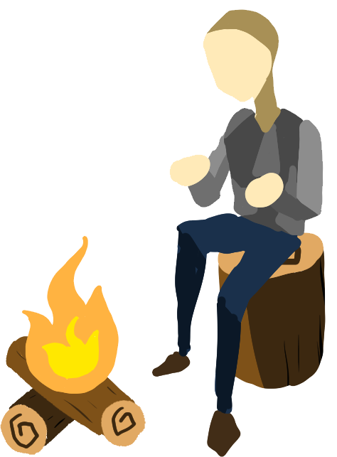

## Gameplay Mechanics 🎮

### Player Perspective

The player will experience the game from a third-person perspective, with the camera positioned behind and slightly above the character. The camera will automatically follow the player's movements, keeping them centered in the frame.

### Controls

The player will use the WASD keys to move the character around the map. Pressing C will open the crafting menu, displaying items that can be crafted based on the materials the player currently possesses. The player can craft an item by left-clicking on it, and all crafted items can be placed on the map. To gather resources, the player needs to stand near a resource structure, like trees or stones, and press E. The E key is also used for any other interactions with objects when the player is within range, such as refueling the light sources. 

  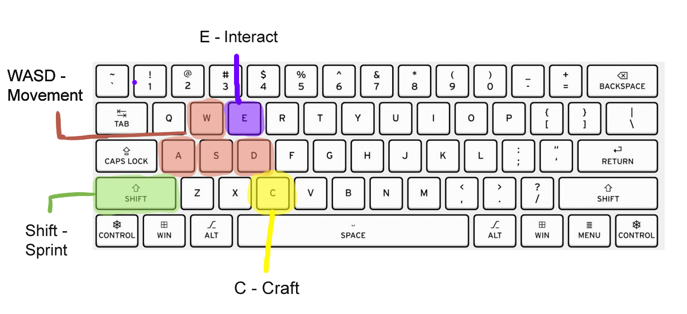

### Crafting & Placing Items

As mentioned in **Controls**, the player can open the crafting menu by pressing C. When the player left-clicks on an item in the crafting menu and press craft, the crafting menu will close, giving the player a full view of the game screen. The selected item will then follow the player's cursor temporarily, allowing the player to left-click again to place the item in the game world.

### Progression

The core gameplay revolves around illuminating new areas. Entering dark zones will cause the player's sanity to rapidly decrease, leading to death if it fully depletes. To progress, the player can collect resources and craft placeable items that allow them to create light sources, pushing back the darkness and unlocking more areas. The goal of the game is to light the map by placing the light sources. It will be tracked by the progress bar on the UI. The game blends city-building and survival elements, appealing to a broad audience. Placing light sources in the dark enhances the eerie atmosphere, adding to the overall experience.

- **Lighting up**: The player finds resources to fuel the existing light sources or create a new one. A higher-tier light source provides a wider coverage radius and longer duration.
- **Venture into the darkness**: The only life source in this game is called “Sanity”. when it reaches 0, the game is over. Staying in the dark greatly consumes sanity. Don’t stay for too long!
- **Stamina**: The player can run with faster movement speed for a short period while consuming stamina until it reaches 0. The stamina bar is refilled automatically.

  

  

- **Increase Sanity**: Standing near the building increases sanity by a fixed rate. Higher tier building provides more sanity. Standing near the light sources does not increase the sanity or reduce it.
- **Crafting items**: The player can use resources to build a structure for beneficial effects or decoration.

  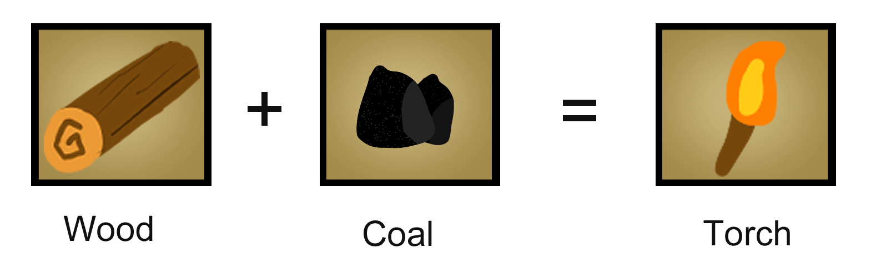

- **Renewable resources**: Resources will automatically spawn periodically. Respawn time depends on the types of resources.

## User Interface (UI) 🛑

The game’s main UI will track the player’s sanity, current materials, and stamina. Additional UI components would include the crafting menu, and the main menu.

*Note: The images shown below are not the final art style used in-game.*

### Main Menu

The Main Menu gives a vibe of eeriness and loneliness. There are two options in the Main Menu which are: Start Game,and Quit Game. **Start Game** option will lead to **Game's main UI**. (Since it is WebGL build, Quit game button does not work.)

  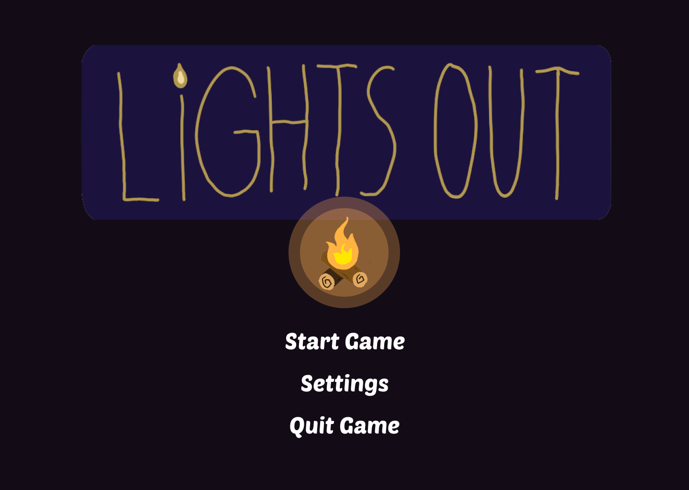

### Game's main UI

The main scenario of the game. The resources counters are shown at the top of the screen. The stamina bar and sanity bar are shown at the bottom-left of the screen. The player will be at the center of the screen and the camera will follow and lock on the player when they are moving.

  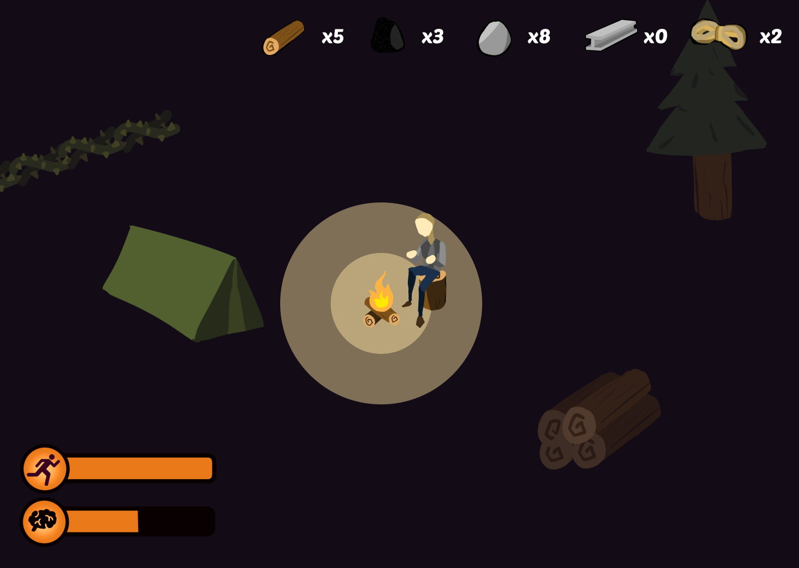

While standing near the interactable object, the pop-up guide show what the player can do.

  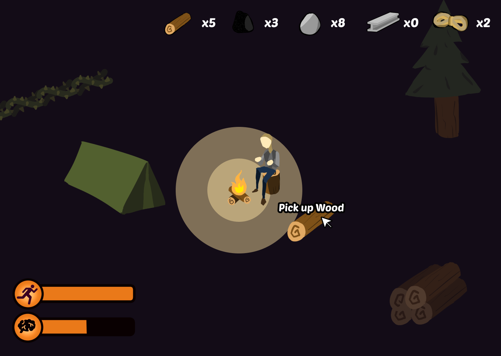

### Crafting UI

Upon opening the crafting menu, the player can choose which items to craft. The player can click the arrow to change to the **Buildings** tab to craft buildings, and the same goes for the **Decorations** tab.
The crafting menu would display the discription including stats and effects of the item, along with the materials required to craft it.

  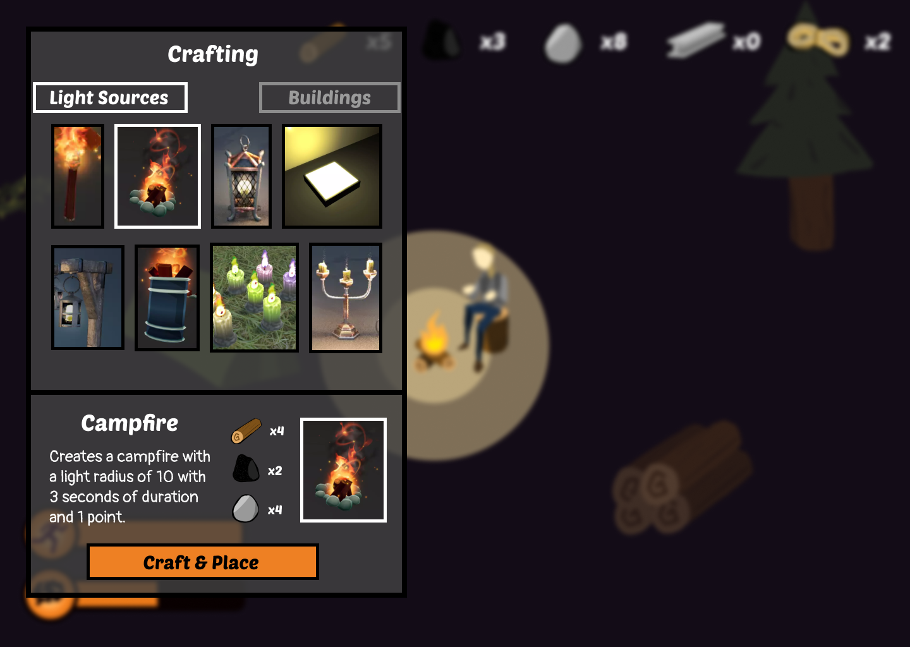

Clicking on an item in which the player has sufficient resource for will prompt the crafting menu to disappear and the player will be able to place that item on the map. If the resources are not enough to craft, there will be a pop-up message notice the player.

  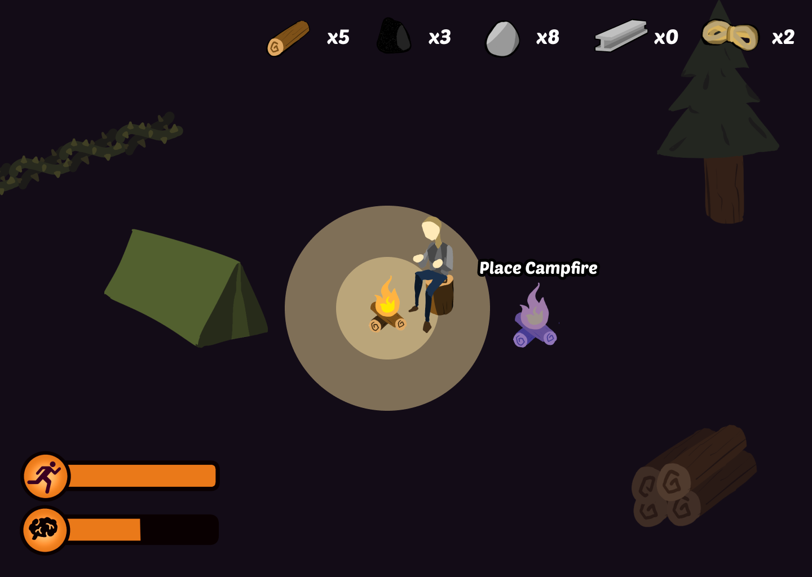

When this happens, the chosen item will follow the player's cursor and has a shade of blue, allowing the him to place it wherever he can hover his cursor to. However, if it has a shade of red, it means that he cannot place the item there.

## Levels and World Design 🌏

### Game World

We’re aiming to create a 2.5D game that combines 3D assets with a 2D layout. The camera will dynamically pan and move based on the player's movements. The player will navigate the game world using the WASD keys. A map will track the player's progress and reveal the portions of the world they've uncovered.

  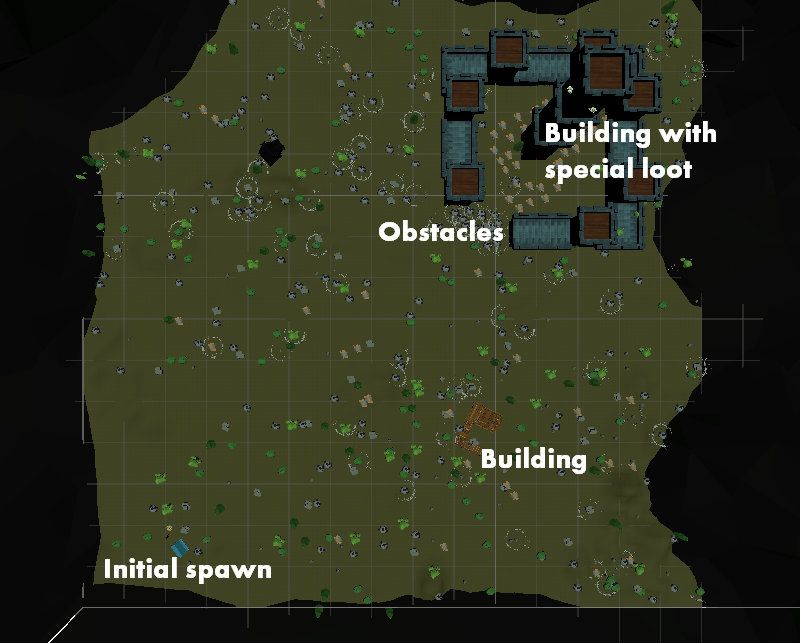

### Objects

- **Light sources**: will be the key element in tracking progress, as the player’s goal is to gradually illuminate the world. These light sources could include items like campfires, torches, and electric lights, each contributing to lighting up different parts of the game world.

  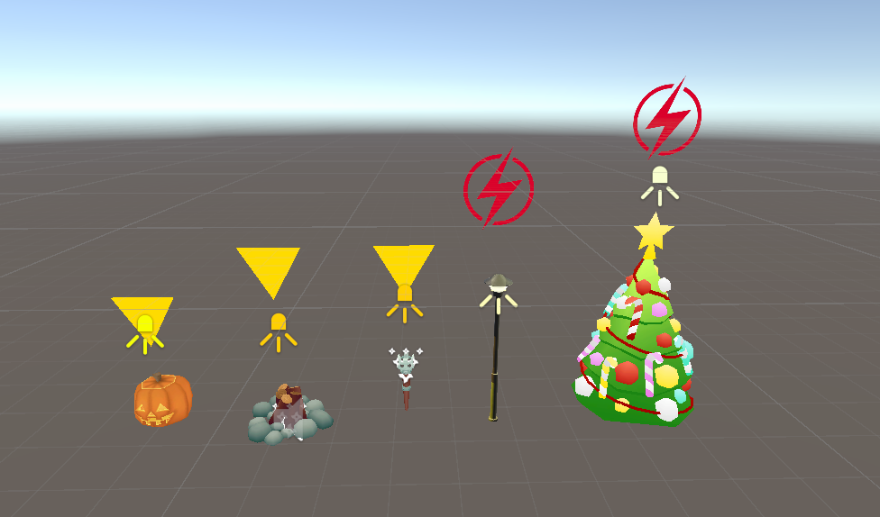

- **Generator**: Electric light sources require power to keep it on. A generator is used to keep these light sources on and must be fed power to keep it running.

  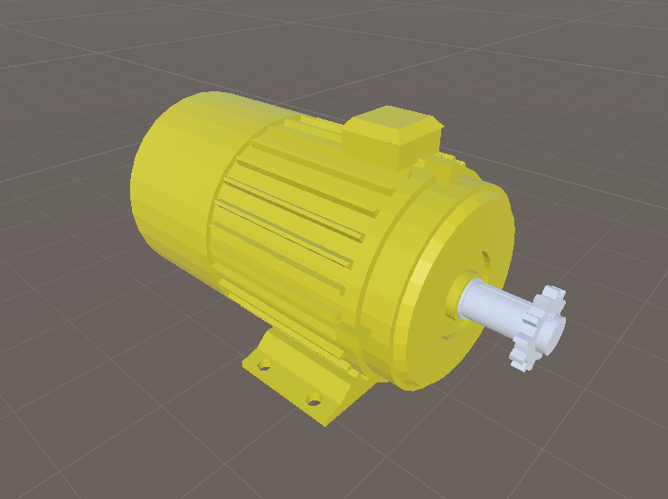

- **Collecting resources**: There are also resources that the player can collect to gather and craft new items, these resources could be wood, coal, fiber, and metal.
- **Buildings/Structures**: Buildings would be objects that the player can create. The initial starting tent can recover sanity. The buildings that the player builds can recover sanity faster and have a larger “sanity recovery effect radius” than the initial tent.

  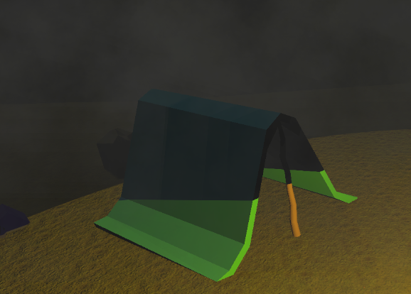

- **Obstacles**: Throughout the map, the player will encounter obstacles that will prevent them from moving through it. To get through these obstacles, the player must light up the surrounding area of the obstacles to go down. An example below is a thorn plant that sprouts when given light, allowing the player to pass through.

  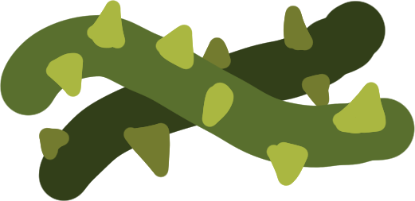

The first stage of the "Thorns" obstacle, which will not allow the player to pass through.

  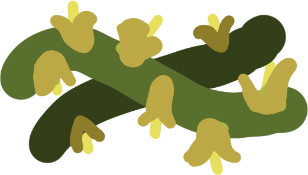

The second stage of the "Thorns" obstacle, where the thorns start to turn into flowers.

  

The final stage of the "Thorns" obstacle, falling apart and allowing the player to pass through it.

- **Ghost**: When the player's sanity go down to a certain ratio, the ghosts will spawn on the map. When the player is near the ghost, their sanity will reduce in a faster rate, so do not go near them, they will be gone eventually.

### Craftables and Interactables

- **Interactables**: Interactables are visible objects on the map, which the player can interact with by pressing E, these Interactables will block the player's path 

  - **Tree**: Trees spawn at random rates around the map in random areas. Interacting with one will trigger a chopping animation, once the animation ends, the tree will fade away and the player will gain _WOOD_ and _FIBER_. 

    | Image                                                                                        | Resources Given       | Times Interactable |
    | -------------------------------------------------------------------------------------------- | --------------------- | ------------------ |
    | 

  | 4 _WOOD_, 4 _FIBER_   | 1                  |
    | 

 | 10 _WOOD_, 10 _FIBER_ | 1                  |
    | 

        | 1 _WOOD_, 1 _FIBER_   | 1                  |
    | 

  | 15 _WOOD_, 15 _FIBER_ | 1                  |

  - **Stone**: Stones spawn at random rate around the map in certain stony areas. Interacting with one will trigger a mining animation, once the animation ends, the player will gain _STONE_. Stones will fade away and disappear once the player has mined it several times.  

    | Image                                                                                          | Resources Given | Times Interactable |
    | ---------------------------------------------------------------------------------------------- | --------------- | ------------------ |
    | 

   | 4 _STONE_       | 4                  |
    | 

  | 8 _STONE_       | 10                 |
    | 

   | 4 _STONE_       | 16                 |
    | 

 | 4 _STONE_       | 32                 |

  - **Ore**: Ore are more rare than stones and trees. Interacting with ores will trigger a mining animation, once the animation ends, the player will gain _COAL_ and _METAL_. Ores will fade away and disappear after being mined several times.  

    | Image                                                                                        | Resources Given       | Times Interactable |
    | -------------------------------------------------------------------------------------------- | --------------------- | ------------------ |
    | 

   | 4 _COAL_, 4 _METAL_   | 10                 |
    | 

   | 8 _COAL_, 8 _METAL_   | 12                 |
    | 

 | 16 _COAL_, 16 _METAL_ | 4                  |

  - **Campfire (Light Sources)**: Certain light sources requires refueling with a certain amount of _COAL_. Upon interacting, an animation of Adam refueling will play, after the animation finishes, the light sources will go back to full brightness and fuel. If light sources run out of fuel. They will stop providing light and will no longer provide protection against the darkness, however, refueling is still possible and would replenish lights and fuel.

  - **Street Lamp (Electric Light Sources)**: Electric light sources do not require refueling directly, but they need to be within the generator radius. The generator need to be refuel with a certain amount of _COAL_. If the generator is down, all the electric light sources will go down as well until the generator is refilled.
  - 
- **Craftables**: Craftables are items that the player can craft, these items would also be placeable on the map, allowing for city-scaping. Craftable items include: Light sources, Buildings, and Decorations 

  - **Light Sources**

    | Name           | Image                                                                                           | Materials Required            | Duration (second) | Light Radius | Points |
    | -------------- | ----------------------------------------------------------------------------------------------- | ----------------------------- | ----------------- | ------------ | ------ |
    | Torch          | 

          | 1 _WOOD_, 1 _COAL_            | 1                 | 1            | 1      |
    | Camp Fire      | 

       | 4 _WOOD_, 2 _COAL_, 4 _STONE_ | 3                 | 10           | 1      |
    | Metal Lantern  | 

  | 1 _COAL_, 2 _METAL_           | 2                 | 2            | 2      |
    | Light Bulb     | 

     | 10 _COAL_, 1 _METAL_          | 3                 | 5            | 5      |
    | Street Lamp    | 

    | 10 _COAL_, 10 _METAL_         | 5                 | 10           | 10     |
    | Burning Barrel | 

 | 5 _WOOD_, 3 _COAL_, 5 _METAL_ | 4                 | 5            | 10     |
    | Candle         | 

         | 1 _WOOD_, 1 _FIBER_           | 1                 | 1            | 1      |
    | Candelabra     | 

     | 3 _WOOD_, 1 _METAL_,          | 2                 | 5            | 3      |

  - **Buildings**
    | Name | Image | Materials Required | Effect Radius | Regen/Second
    | --- | --- | --- | --- | --- |
    | Tent | 

 | 10 _WOOD_, 10 _FIBER_| 1| 1 |
    | Wooden House | 

 | 50 _WOOD_| 3 | 3 |
    | Wooden Tent | 

 | 25 _WOOD_| 2 | 1 |
    | Big Wooden House | 

 | 100 _WOOD_| 6 | 5 |
    | Castle | 

 | 20 _WOOD_, 50 _STONE_| 10 | 10 |
    | Roman House | 

 | 50 _WOOD_, 50 _STONE_ | 5 | 15 |
    | Medieval House | 

 | 20 _WOOD_, 50 _STONE_ | 5 | 10 |
    | Holiday House | 

 | 80 _WOOD_, 80 _STONE_ | 5 | 20 |

  - **Decoration**
    | Name | Image | Materials Required |
    | --- | --- | --- |
    | Flower pot | 

 | 1 _WOOD_, 1 _FIBER_ |
    | Barrel | 

 | 5 _WOOD_ |
    | Bush | 

 | 3 _WOOD_, 3 \*_FIBER_ |
    | Bridge | 

 | 15 _WOOD_ |
    | Fence | 

 | 10 _WOOD_ |
    | Log | 

 | 1 _WOOD_ |
    | Boulder | 

 | 10 _STONE_ |
    | Chest | 

 | 10 _WOOD_, 5 _METAL_ |
    | Tree | 

 | 5 _WOOD_, 5 _FIBER_ |
    | Benche | 

 | 15 _WOOD_, 5 _METAL_ |

## Art and Audio 🎨 🔊

### Art Style

Low-poly 3D models that feature a slightly dark tone that goes well with the darkness featured in the game.

### Sound and Music

Sounds that give the player a sense of loneliness would work best with this game. The sound gives the errie ambience and each items have sound indicator such as generator working sound, or the sound when gaining sanity.

### Assets

We plan to use the following assets from the Unity Asset Store.

| Asset                               | Preview                                                                                        | URL                                                                                                              |
| ----------------------------------- | ---------------------------------------------------------------------------------------------- | ---------------------------------------------------------------------------------------------------------------- |
| RPG Poly Pack - Lite                | 

             | <https://assetstore.unity.com/packages/3d/environments/landscapes/rpg-poly-pack-lite-148410>                     |
| LowPoly Survival Character Rio      | 

    | <https://assetstore.unity.com/packages/3d/characters/humanoids/lowpoly-survival-character-rio-273074>            |
| Campfires & Torches Models and FX   | 

      | <https://assetstore.unity.com/packages/3d/environments/campfires-torches-models-and-fx-242552>                   |
| Low Poly Nature Pack Lite           | 

      | <https://assetstore.unity.com/packages/3d/environments/landscapes/low-poly-nature-pack-lite-288596#content>      |
| Wooden House - Free - Low Poly      | 

         | <https://assetstore.unity.com/packages/3d/environments/wooden-house-free-low-poly-270889>                        |
| Low_Poly Nature                     | 

           | <https://assetstore.unity.com/packages/3d/environments/low-poly-nature-260306>                                   |
| Street Lamps                        | 

              | <https://assetstore.unity.com/packages/3d/props/exterior/street-lamps-165658>                                    |
| Street Lamps 2                      | 

             | <https://assetstore.unity.com/packages/3d/props/exterior/street-lamps-2-260395>                                  |
| Modular Medieval Lanterns           | 

 | <https://assetstore.unity.com/packages/3d/environments/historic/modular-medieval-lanterns-85527>                 |
| FREE Low Poly Human - RPG Character | 

        | <https://assetstore.unity.com/packages/3d/characters/humanoids/fantasy/free-low-poly-human-rpg-character-219979> |
| Low Poly: Woods Lifestyle           | 

  | <https://assetstore.unity.com/packages/3d/environments/low-poly-woods-lifestyle-65306>                           |
| Low-Poly Resource Rocks             | 

   | <https://assetstore.unity.com/packages/3d/props/exterior/low-poly-resource-rocks-76150>                          |
| Roman City Low Poly Pack 1 - Lite   | 

                 | <https://assetstore.unity.com/packages/3d/environments/roman-city-low-poly-pack-1-lite-92731#content>            |
| Medieval Building Exteriors         | 

     | <https://assetstore.unity.com/packages/3d/environments/historic/medieval-buildings-exteriors-72836>              |
| Low Poly Holiday House              | 

    | <https://assetstore.unity.com/packages/3d/environments/urban/lowpoly-holiday-house-95243>                        |
| Low Poly Modern City Decorations    | 

      | <https://assetstore.unity.com/packages/3d/environments/urban/lowpoly-holiday-house-95243>                        |

<!--
    Put images / sketches of User Interface here.
 -->

## Team Communication, Timeline and Task Assignment 🤝

### Tools 🔧

| Tool       | Used For                                         | Link                                                                                    |
| ---------- | ------------------------------------------------ | --------------------------------------------------------------------------------------- |
| Discord    | General team communication and stand-up meetings | <https://discord.gg/PNK58X9Q>                                                           |
| Jira       | Task management                                  | <https://h1pls.atlassian.net/jira/software/projects/KAN/boards/1/timeline>              |
| Confluence | Documentation                                    | <https://h1pls.atlassian.net/wiki/external/MDNmMGVlZmNmZjQyNDg5YTlmZDg4YTU2NzlkMWM5ODg> |
| Github     | Code and asset management                        | <https://github.com/feit-comp30019/2024s2-project-1-h1pls>                              |

### Timeline & Task Assignment 📆

  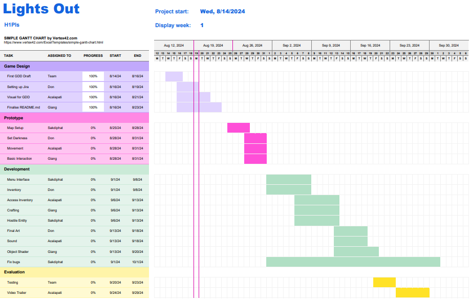

## Possible Challenges ⚠️

| **Challenge**                                            | **Type**            | **Description**                                                                                                                                                                                                                             | **Solution**                                                                                                                                                                                                                                                                                                                                                                                                                                                    |
| -------------------------------------------------------- | ------------------- | ------------------------------------------------------------------------------------------------------------------------------------------------------------------------------------------------------------------------------------------- | --------------------------------------------------------------------------------------------------------------------------------------------------------------------------------------------------------------------------------------------------------------------------------------------------------------------------------------------------------------------------------------------------------------------------------------------------------------- |
| Adapt to new technology and development concepts.        | Technical           | Most team members in our group have little to no experience in Game Development and working with Unity. This slows down the game's development progress and we may end up with an unfinished game if this issue is not carefully addressed. | To mitigate this issue, each member of our team will dedicate time outside of tutorials and lectures to learn Unity and Game Development. In addition, we aim to communicate and share our knowledge regularly to help everyone improve their proficiency with the new technology.                                                                                                                                                                              |
| Develop a complete game within a tight 12-week deadline. | Time Constraint     | The limited timeframe poses a lot of potential issues with having incomplete features and team member burnout if not well-managed.                                                                                                          | To address this, our team will define a clear and achievable scope for the game from the start, focusing on core gameplay mechanics and essential features. We will also make use of project management tools such as Jira and Confluence to ensure that each milestones are met and adjust the scope if necessary to stay within the timeline. In addition, we will also schedule regular, in-person meetings every week to check in on each member's progress. |
| Finding suitable music and SFX                           | Creative / Resource | We're aiming to find music and SFX that capture a sense of haunting loneliness and isolation. Unfortunately, the free assets available on the Unity Asset Store don't meet our specific needs.                                                | Our team will explore alternative sources for royalty-free music and SFX such as Freesound, OpenGameArt.org, and Freesfx.                                                                                                                                                                                                                                                                                                                                       
