# Project 2 Report

Read the [project 2 specification](https://github.com/feit-comp30019/project-2-specification) for details on what needs to be covered here. You may modify this template as you see fit, but please keep the same general structure and headings.

Remember that you must also continue to maintain the Game Design Document (GDD) in the `GDD.md` file (as discussed in the specification). We've provided a placeholder for it [here](GDD.md).

---

## Table of Contents

- [Evaluation Plan](#evaluation-plan)
- [Evaluation Report](#evaluation-report)
- [Shaders and Special Effects](#shaders-and-special-effects)
- [Summary of Contributions](#summary-of-contributions)
- [References and External Resources](#references-and-external-resources)

---

## Evaluation Plan

### Observational Technique - Cooperative Evaluation

- Analyst and participant evaluate the game together.
- Identified problems and potential solutions are discussed together with participants.
- Questions to ask participants:
   - How did the atmosphere of the game make you feel throughout your gameplay experience?
   - What aspect of the game stood out to you the most?
   - Was there any moment where you felt confused or uncertain about what to do next?
   - How did the eerie elements (SFX) affect your exploration of the game environment?
   - How are the controls?
   - What do you like most about our game?
   - What do you think could be improved?
   - What do you think of the difficulty of the game?
   - What do you think the game is lacking to achieve a more eerie effect?
   - What part of the game do you think is the most engaging? What part feels boring?
   - Were there any moments where the atmosphere didn’t feel eerie/unsettling? What contributed to that?
   - What are your thoughts when balancing your sanity bar and crafting light sources in the game? Did you face any challenges?

#### Protocol for Game Testing - Cooperative Evaluation 

**Overview**

This protocol outlines a process for conducting a cooperative evaluation of test players engaging with a game, focusing on collaborative assessment and feedback.

**Objectives**

- Observe player interactions.
- Identify issues and gather feedback.
- Discuss potential solutions together.

**Preparation**

1. **Select Participants:** 
   - Recruit at least 5 players representing your target audience.

2. **Set Up Environment:** 
   - Ensure a comfortable, distraction-free space with all necessary equipment.

3. **Materials:** 
   - Prepare observation checklists and recording tools (with consent).

**Protocol Steps**

1. **Introduction (5 min):**
   - Introduce participants and explain the purpose of the evaluation.

2. **Gameplay Session (15 min):**
   - Allow participants to play while analysts observe and take notes.

3. **Cooperative Discussion (10 min):**
   - Gather for a discussion, encouraging participants to share their experiences.
   - Analysts facilitate conversation about identified issues and potential solutions.

4. **Wrap-Up (5 min):**
   - Summarise findings and thank participants for their input.

**Post-Session**

1. **Analyse Notes:**
   - Review notes and recordings, compiling a report on key findings.

2. **Prioritise Issues:**
   - Rank issues based on how often they occur and their impact, discussing with the development team.

3. **Follow-Up:**
   - Share findings with everyone involved and plan future evaluations if necessary.

---

### Query Technique - Questionnaire

- Participants will play the game on WebGL and fill out a survey form.
- The survey form will include sections to rate various aspects of the gameplay and give text feedback.
-  Things we want feedback/ratings on:
   - How does the player feel whilst playing the game?
   - What do they think about the sanity system (does it stress them out)?
   - Does the player feel incentivized to craft light sources?
- Link to questionnaire: https://forms.gle/CN99nJRuxXeCCNT59

#### Query Technique Protocol for Game Testing

**Overview**

This protocol outlines the process for using questionnaires to gather feedback from participants after playing a game on WebGL. The goal is to assess various aspects of the gameplay and collect both quantitative and qualitative feedback.

**Objectives**

- Gather participant ratings on different gameplay aspects.
- Collect textual feedback for each gameplay aspect and the overall game experience.

**Preparation**

1. **Select Participants:**
   - Recruit at least 5 players representing your target audience.

2. **Set Up Environment:**
   - Ensure a comfortable, distraction-free space with access to the game on WebGL.

3. **Materials:**
   - Prepare a questionnaire that includes:
     - Rating scales for different gameplay aspects.
     - Open-ended text fields for feedback.

**Questionnaire Structure**

1. **Gameplay Rating Section:**
   - Include a rating scale (e.g., 1 to 5) for each aspect, such as:
     - Graphics
     - Controls
     - Difficulty
     - Enjoyment

2. **Feedback Section:**
   - Provide text fields for participants to offer detailed feedback:
     - Comments on each gameplay aspect.
     - Overall feedback on the game.

**Protocol Steps**

1. **Introduction (5 min):**
   - Introduce participants to the study and explain the purpose of the questionnaire.

2. **Gameplay Session (15 min):**
   - Allow participants to play the game on WebGL for the allocated time.

3. **Questionnaire Completion (10 min):**
   - Direct participants to fill out the survey form after gameplay.
   - Encourage them to provide honest feedback and explanations for their ratings.

4. **Wrap-Up (5 min):**
   - Thank participants for their time and contributions.
   - Remind them of the importance of their feedback for game development.

**Post-Session**

1. **Analyse Responses:**
   - Review the completed questionnaires, compiling quantitative ratings and qualitative feedback.

2. **Identify Key Themes:**
   - Look for common trends in ratings and comments to highlight areas for improvement.

3. **Follow-Up:**
   - Share findings with the development team and plan for any necessary adjustments based on participant feedback.

---

### Participants

- **Target Audience**: Teenagers and young adults aged 15 - 28.
- **Recruitment Methods**:
  1. Ask university friends and family to volunteer.
  2. Post on social media/online platforms such as Reddit.

---

### Data Collection

- **Quantitative Data**:
  - Gameplay rating: Game mechanic / Graphic / Theme.
  - Satisfaction.
  
- **Qualitative Data**:
  - Feedback: What they like/dislike, and what could be improved.

- **Tools**: Use a questionnaire (survey) for both quantitative and qualitative data.

---

### Data Analysis

#### For Observational Technique:
- **Affinity Diagram**: Analyse main findings by grouping similar insights.

#### For Questionnaire:
- **Summary Statistics**: Analyse summary statistics of quantitative data (i.e. mean, median, standard deviation).
- **Visual Graphs**: Produce graphs of the scores for each aspect of the game to identify areas that need improvement.

---

### Timeline
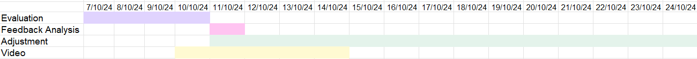

---

### Responsibilities

Who is responsible for each task? How will you ensure that everyone contributes equally?

| Team Member                | Responsibility             |
|----------------------------|----------------------------|
| Sakdiphat Tanphiphatari    | Observational Technique    |
| Acalapati Priyatama        | Query Technique            |
| Don Lam Nguyen             | Observational Technique    |
| Duc Hang Giang Vu          | Query Technique            |

---

## Evaluation Report

In total, we conducted 7 surveys for a query technique, and 7 cooperative evaluations for an observation technique.

The raw data for survey is here [survey raw data](EvaluationData/Survey_raw.pdf)
The observation note is here [observation note raw data](EvaluationData/Observation_raw.pdf)

### Quantitative Data

| Category   | Average Score | Scaling                   | Note                                        |
|------------|---------------|---------------------------|---------------------------------------------|
| Enjoyment  | 3.57/5        | Higher = Very enjoyable   |                                             |
| Difficulty | 4/5           | Higher = Difficult        |                                             |
| Control    | 3.14/5        | Higher = Easy control     | The major problem is the camera control     |
| UI Layout  | 3.29/5        | Higher = Easy to navigate | The layout is simple but has some problems. |
| Audio      | 3.57/5        | Higher = Satisfy          |                                             |
| Graphic    | 3.43/5        | Higher = Satisfy          |                                             |
| Story      | 3.43/5        | Higher = Like the story   |                                             |

The table displays the average score for the query technique over 7 evaluators on a scale of 1 to 5.

These categories of questions gave us valueble insights into what the game was lacking. Higher scores in diffuculty means many people were struggling to experience later stages of the game, which can lead to repetitive early game experience, causing quick boredom. Scores for UI and control fluctuates at around the mid point mark, which will be reflected more efficiently in the observational section. Lower scores in graphics and audio signifies a lack in the game's erie ambience.

### Qualitative Data
Data collected from observational evaluations are organized into an affinity diagram as follow, separating them into 6 main categories:

  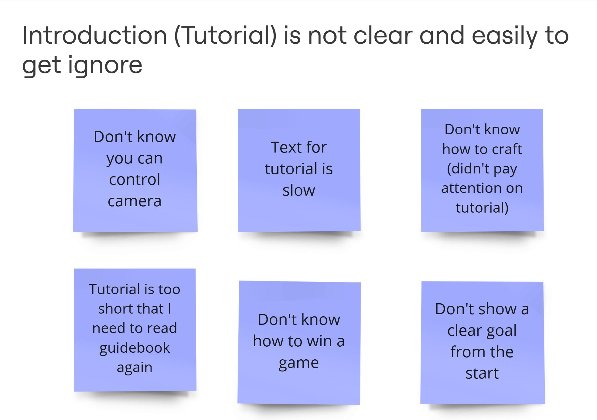

The **Introduction** did not serve it's purpose, as feedbacks shows players struggling to find the goal of the game, and the incentive to explore.

  

The **Difficulty** section provides an understanding into our game's progress rate. Feedbacks were mainly focused on our sanity penalization mechanics rather than the progress speed of the game itself.

  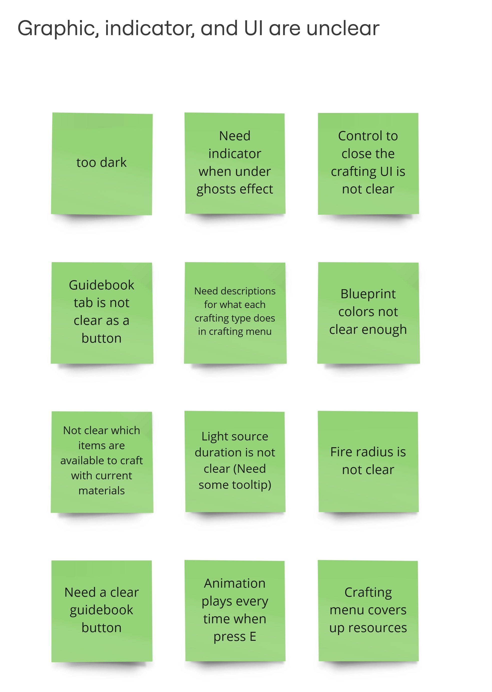

Most participants stated that the graphic was unclear about the crafting resources. The overall UI layout of the crafting system is also unclear.

  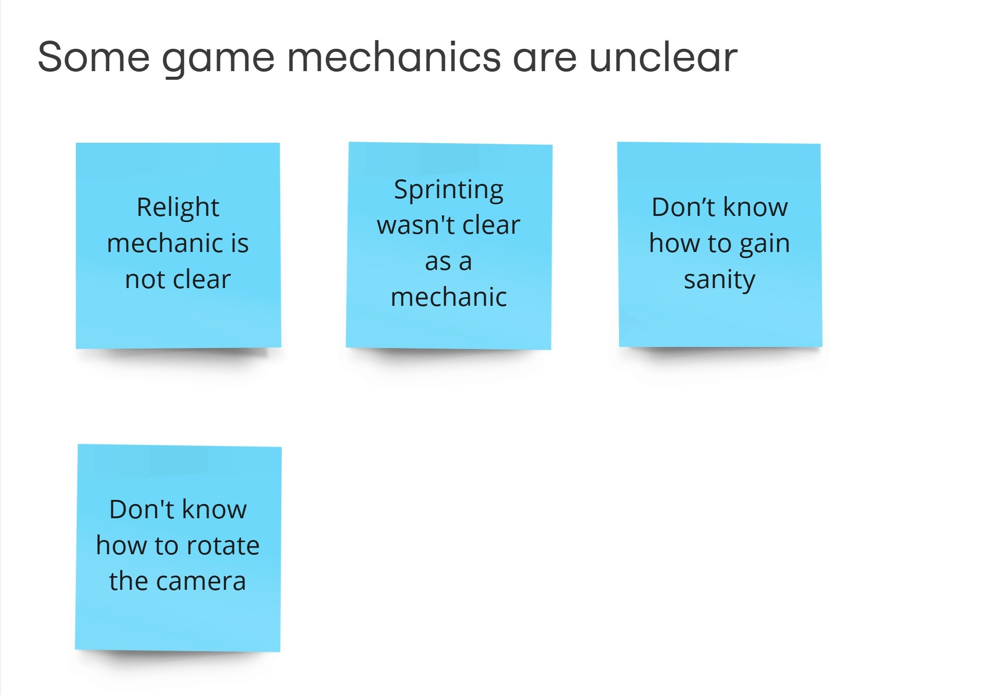

The general concensus of the **Game Mechanics** section is that our tutorial did not manage to serve it's purpose. Leading to evaluator's confusion upon playing. A more thorough introduction and tutorial was needed.

  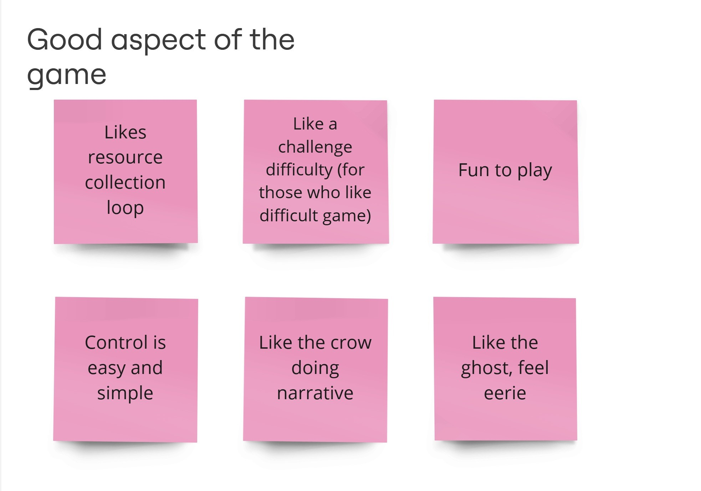

Almost all participants loved the theme and the concept of the game. The dark theme was reported to be interesting and exploration of natural artefacts provides alot to the gameplay experience

  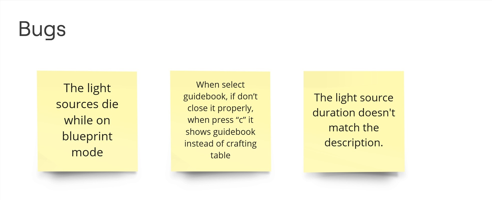

### Improvements

Under the Improvement Section of our game evaluation report, several key changes were implemented to address user feedback and enhance gameplay.

One prominent issue involved the gathering animation; previously, pressing "E" would trigger the animation regardless of the player’s distance from interactable items, disrupting movement. This has been refined so that animations only play when close to an interactable object, allowing for smoother exploration.

Players also struggled to understand they could relight light sources due to a lack of indicators. Now, light sources become relightable only when near extinguishment, with an indicator to clearly signal this, making this mechanic more intuitive.

The crafting menu was restructured due to its interference with visibility of resource counts. By reducing the menu’s vertical space, players can now view resources without obstruction, streamlining the crafting process.

Due to minimal guidance, some players overlooked essential controls like sprinting and camera adjustments. To enhance clarity, a step-by-step tutorial was added at the start of the game, and the guidebook was relocated to the main screen for easier access.

Feedback also revealed that sanity loss was too high, making survival overly difficult. We reduced the sanity reduction from darkness and ghost encounters, increased sanity regeneration from buildings, and lowered the ghosts' range to create a more balanced challenge.

Additionally, lighting adjustments were made to encourage exploration, as previous brightness levels deterred players from venturing into dark areas. By increasing the brightness of both darkness and light sources, players can navigate more confidently.

To enhance player awareness, an extra visual effect and sound cue were added when in a ghost’s range, enabling players to gauge danger more effectively.

Several environmental adjustments were also made: the starting area now includes a tent, improving initial survivability, and resource outlines were added to improve visibility in general.

In response to camera sensitivity, which was deemed too high, sensitivity settings were lowered, providing players with smoother control.

Finally, adjustments were made to increase the initial cutscene text speed for a more fast paced experience, and bugs reported by players were systematically addressed and fixed.

These improvements collectively work to create a more engaging, intuitive, and enjoyable gaming experience based on player insights.

---

## Shaders and Special Effects

### Shader #1 - Blueprint Shader

**Blueprint Shader File:** [link](./Assets/_Shaders/BlueprintShader.shader) 

**Description:**  
The Blueprint Shader applies a holographic effect on items being placed in the game world. The colour is adjustable via uniform variables in a C# script. When an item cannot be placed, i.e. blocked by obstacles, the colour is red; otherwise, the colour is blue to indicate that the item can be placed.

  
  
<strong>Blueprint Shader Demo</strong>

**Rationale:**  
Crafting is a core mechanic of our game, therefore it's important to provide visual feedback during item placement to improve the player experience. This shader visually indicates placement states, reducing confusion and enhancing interaction with crafting mechanics.

**Theory:**  
The vertex shader is mostly untouched given that we do not wish to displace vertices of the input object’s mesh for a blueprint / hologram effect. Instead, to emulate a hologram effect, the fragment shader renders bars running across the object using the UV coordinates and the sine wave function to set output rgb to 0 at set intervals. The animation of the bars moving is done by translating the sine wave function with respect to game time.

**Material Parameters:**
- [Blueprint Material Link](./Assets/_Shaders/BlueprintShader_Material.mat)

 

  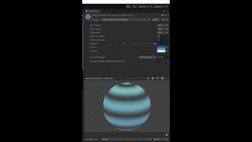
  
<strong>_HoloIntensity: Controls bar quantity; higher values increase bar density.</strong>

 

  
  
<strong>_AnimIntensity: Sets bar movement speed; higher values increase speed.</strong>

 

  
  
<strong>Determines bar orientation; 0 is vertical, 1 is horizontal, interpolated between.</strong>

**C# Script for Color Parameters:**
- [C# Script Colour Modification Link](./Assets/_Scripts/Crafting/PlaceItem.cs)

- The parameters being set in this C# script are _Color1 and _Color2. The colour of the object is interpolated between _Color1 and _Color2 to form a gradient. This makes the object’s colour more dynamic and complex.

 

  <pre style="width: 80%; max-width: 600px; text-align: left; padding: 10px; border-radius: 5px;">
   private void SetPlaceable()
   {
      ... Some other code here
        foreach (Renderer renderer in renderers)
        {
            foreach (Material material in renderer.materials)
            {
               material.SetColor("_Color1", new Color(0.0f, 0.0f, 0.55f));
               material.SetColor("_Color2", new Color(0.68f, 0.85f, 0.9f));
            }
        }
      ... Some other code here
   }
  </pre>

  
<strong>The colour scheme of the object is set to blue when the item can be placed at the current location.</strong>

 

  <pre style="width: 80%; max-width: 600px; text-align: left; padding: 10px; border-radius: 5px;">
   private void SetUnplaceable()
   {
      ... Some other code here
        foreach (Renderer renderer in renderers)
        {
            foreach (Material material in renderer.materials)
            {
               material.SetColor("_Color1", new Color(0.55f, 0.0f, 0.0f));
               material.SetColor("_Color2", new Color(1.0f, 0.6f, 0.6f));
            }
        }
      ... Some other code here
   }
  </pre>

  
<strong>The colour scheme of the object is set to red when the item cannot be placed at the current location.</strong>

---

### Shader #2 - Ghost Shader

**Ghost Shader File**: [link](./Assets/_Shaders/GhostShader.shader)

**Description:**  
The Ghost Shader is used to create a material for ghosts, giving them a slightly distorted and semi-transparent look. Transparency can be adjusted through a uniform variable in a C# script. This allows for a smooth “fading in” effect, enhancing the ghost's appearance as it materializes in the game.

  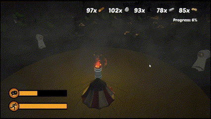
  
<strong>Ghost Shader Demo</strong>

**Rationale:**  
The Ghost Shader is essential for our game, as ghosts are a key feature that adds to its eerie atmosphere. The shader creates a distorted, transparent appearance that enhances the creepy effect of the ghosts. It is difficult to do vertex distortion purely through C# code, which is why a shader is used. Additionally, the ability to adjust parameters for a ghost fade-in effect adds polish to the game, ensuring a smooth transition when the ghost appears.

**Theory:**  
The distortion effect is achieved by displacing the input vertex in the vertex shader using a sine wave function that varies with game time. This produces a moving wave animation on the ghost's body. To enhance the ghostly look, the fragment shader adjusts the alpha channel and RGB values, making the ghost appear more transparent and dimmed.

**Material Parameters:**  
- [Ghost Material Link](./Assets/_Shaders/GhostShader_Material.mat)

 

  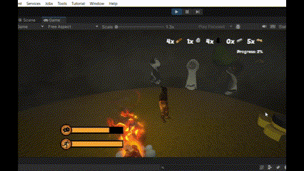
  
<strong>_MainTex allows the ghost to have different textures applied. Above are the ghosts with 3 different textures.</strong>

 

  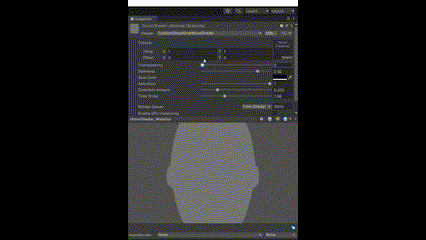
  
<strong>_Transparency adjusts the see-through effect.</strong>

 

  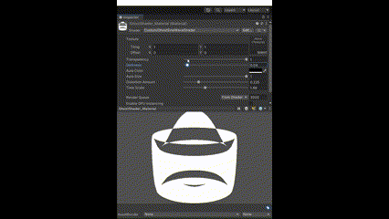
  
<strong>_Darkness adjusts the dimness of the output RGB channels</strong>

 

  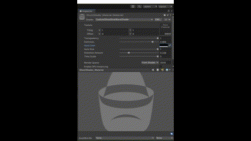
  
<strong>_AuraColor determines the colour of the ghost.</strong>

 

  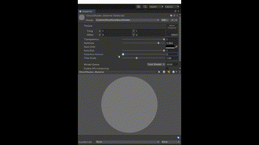
  
<strong>_DistortionAmount adjusts distortion intensity.</strong>

 

  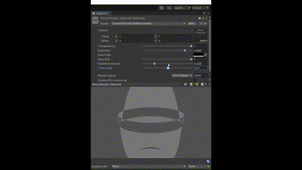
  
<strong>_TimeScale adjusts wave animation speed.</strong>

**C# Script for Fading Effect:**  
- [C# Script Fading Effect Link](./Assets/_Scripts/WorldObjects/GhostController.cs)

 

  <pre style="width: 90%; text-align: left; padding: 10px; border-radius: 5px;">
   private IEnumerator FadeIn()
   {
      float elapsedTime = 0;
      while (elapsedTime < fadeDuration)
      {
         ... Some calculations here
         float newTransparency = Mathf.Lerp(0, originalTransparency, t);
         originalAuraColor.a = Mathf.Lerp(0, originalAuraColor.a, t);
         ghostRenderer.material.SetFloat("_Transparency", newTransparency);
         ghostRenderer.material.SetColor("_AuraColor", originalAuraColor);
         ...
      }
      ... Some cleanup logic here
   }
  </pre>

  
<strong>_Transparency and _AuraColor are interpolated with respect to animation time.</strong>

---

### Fog Particle System

**Fog Particle System File:** [link](./Assets/EnvironmentAsset/Fog/FogParticleSystem.prefab)

**Description:**  
The fog particle system generates volumetric fog that enriches the game environment. This fog enhances the overall aesthetics and contributes to the game's eerie atmosphere.

**Rationale:**  
The fog particle system is essential for our game, as it deepens the eerie ambiance and unifies the visual elements. By adding fog, we create a more immersive experience, making the environment feel more atmospheric and visually appealing.

  
  
<strong>Fog vs No Fog Demo</strong>

**Randomized Attributes for Natural Fog Effects:**  

- **Start Speed:**  
    
   

      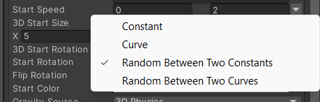
      
<strong>Speed randomised between 0 and 2 for natural dispersion.</strong>

   
  
  
  **Description:** Start speed defines the initial velocity of each particle, influencing how fast particles move upon spawning. By randomizing this value, each particle has a slight variation in speed, leading to a more natural, dispersed fog effect.

  **Rationale:** Fog in nature doesn’t move at a uniform speed; pockets of mist vary in movement. The randomness in start speed gives the fog a more organic, drifting appearance, enhancing realism.

- **Start Rotation:**  
    
   

      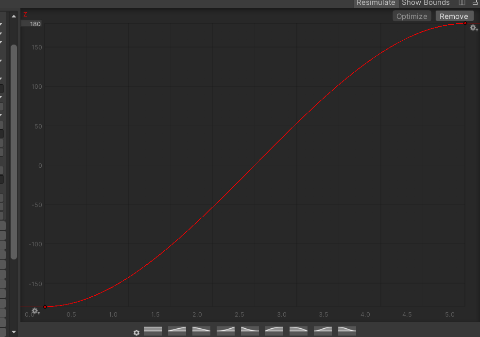
      
<strong>Rotation follows a curve, simulating swirling fog.</strong>

   
  
    
  **Description:** Start rotation defines the initial orientation of each particle. The rotation curve ensures particles have gradual orientation shifts. Starting at a low rotation and increasing along a curve means particles will gradually adjust their angles.

  **Rationale:** This curve simulates the swirling and slight rotation typical of fog or mist, making it appear as though the fog is naturally turning and blending within itself. The curve shape makes the rotation predictable but still dynamic, aligning with the slow, rolling nature of fog.

- **Randomise Direction:**  
    
   

      
      
<strong>Particles emit in random directions for realistic diffusion. </strong>

   
   
   
  **Description:** When this option is enabled, particles are emitted in random directions rather than following a strict path.  
  
  **Rationale:** Fog generally disperses in all directions, so randomizing the emission direction allows particles to spread unpredictably, achieving a more diffused, realistic fog volume. This also prevents unnatural movement patterns and avoids the "layered" look common with directional fog particles.

---

## Summary of Contributions

#### Don Lam Nguyen:
- Even out lightings (disabling URP’s fade quadratic attenuation)
- Created lightsource prefabs and lightsources scripts
- Refueling, and refueling Marker
- Buildings prefabs, and handling effects of buildings
- Description for craftables

#### Duc Hang Giang Vu:
- Implement the player (movement, animations, sanity, sprinting, etc.)
- Implement Ghost & Fog Particle System spawn/control logic
- Implement crafted item placement logic
- Add SFX (ambience, resource collection, etc.)
- Shaders and Special Effects report

#### Acalapati Priyatama:
- Designed the user interface including the HUD, guidance, and crafting UI
- Created the logic behind the crafting system used in the game
- Wrote the custom shaders used in the game including the Blueprint Shader and the Ghost Shader
- Designed the core gameplay loop
- Created the video trailer and in-game cutscenes

#### Sakdiphat Tanphiphatari:
- Created auto spawn resources script
- Designed the world terrain
- Created an electric light source
- Fixed minor bugs
- Evaluation report summary

---

## References and External Resources

- **Unity Assets and Documentation**
   - [Unity Asset Store](https://assetstore.unity.com/)
   - [Unity Documentation](https://docs.unity.com/)

- **External Assets**  
   - 	https://assetstore.unity.com/packages/3d/environments/3d-simple-building-hotel-213775
   -	https://assetstore.unity.com/packages/3d/environments/fantasy/fantasy-house-bundle-257964
   -	https://assetstore.unity.com/packages/3d/environments/desert-village-houses-lowpoly-200247
   -	https://assetstore.unity.com/packages/3d/environments/historic/medieval-tent-big-19023
   -	https://assetstore.unity.com/packages/3d/environments/low-poly-medieval-free-pack-253520
   -	https://assetstore.unity.com/packages/3d/environments/historic/medieval-buildings-exteriors-72836
   -	https://assetstore.unity.com/packages/3d/environments/urban/city-traffic-lights-pack-free-low-poly-3d-art-154053
   -	https://assetstore.unity.com/packages/3d/props/jack-o-lantern-12185
   -	https://assetstore.unity.com/packages/3d/environments/landscapes/rpg-poly-pack-lite-148410
   -	https://assetstore.unity.com/packages/3d/environments/campfires-torches-models-and-fx-242552
   -	https://assetstore.unity.com/packages/3d/environments/landscapes/low-poly-nature-pack-lite-288596#content
   -	https://assetstore.unity.com/packages/3d/environments/wooden-house-free-low-poly-270889
   -	https://assetstore.unity.com/packages/3d/props/exterior/street-lamps-2-260395
   -	https://assetstore.unity.com/packages/3d/characters/humanoids/fantasy/free-low-poly-human-rpg-character-219979
   -	https://assetstore.unity.com/packages/3d/props/exterior/low-poly-resource-rocks-76150
   -	https://assetstore.unity.com/packages/3d/props/industrial/industrial-equipment-electric-motor-199519
   -	https://assetstore.unity.com/packages/3d/vegetation/trees/polycraft-christmas-tree-108277
